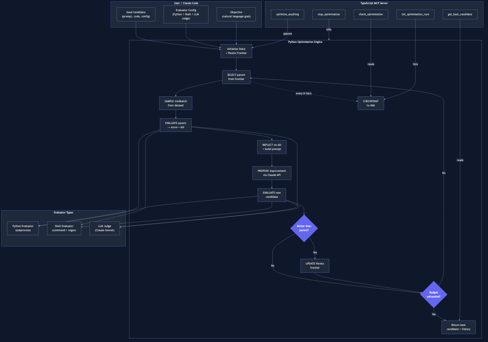

# optimize-anything

A universal optimization system that improves any text artifact — prompts, code, configs, agent architectures — through iterative LLM-powered search with evaluation feedback.

Inspired by GEPA's optimize_anything API. Uses Claude as both the proposer (to generate improvements) and optionally as an evaluator (LLM-as-judge).

## Architecture



## Documentation

| Document | Description |
|----------|-------------|
| [Design Document](docs/plans/optimize-anything-design.md) | Architecture decisions, component specs, data model |
| [Implementation Plan](docs/plans/implementation-plan.md) | 12-task build plan with full code listings |
| [Skill Optimization Demo](scripts/optimize_skill.py) | Example: optimizing a Claude Code skill from 91% to 100% |

## How It Works

```
1. Start with a seed candidate (any text artifact)
2. Evaluate it → get a score + diagnostic feedback (ASI)
3. Claude reflects on the diagnostics and proposes an improvement
4. Evaluate the new candidate on the same examples
5. If better, accept it and update the Pareto frontier
6. Repeat until budget exhausted
```

This is **intelligent search, not blind evolution**. The proposer sees exactly what went wrong (errors, scores, traces) and makes targeted fixes.

## Quick Start

### Python Library

```bash
cd engine && uv sync
```

```python
from optimize_anything import optimize_anything, Config

def evaluator(candidate, example=None):
    """Score: what fraction of target words appear in the candidate."""
    targets = {"clear", "concise", "helpful"}
    found = sum(1 for w in targets if w in candidate.lower())
    return found / len(targets), {"found": found}

result = optimize_anything(
    seed_candidate={"system_prompt": "You are an assistant."},
    evaluator=evaluator,
    objective="Maximize clarity, conciseness, and helpfulness",
    config=Config(max_iterations=10),
)

print(result.best_candidate)  # {"system_prompt": "You are a clear, concise, helpful..."}
print(result.best_score)      # 1.0
```

### CLI

```bash
# Create a config file
cat > config.json << 'EOF'
{
  "seed_candidate": {"prompt": "Summarize the input"},
  "evaluator": {
    "type": "llm_judge",
    "criteria": "Rate clarity, specificity, and completeness. SCORE: X/10"
  },
  "objective": "Optimize for summary quality",
  "config": {"max_iterations": 20}
}
EOF

# Run optimization
cd engine && uv run optimize-anything run --config config.json --events

# Check status of a run
uv run optimize-anything status --run-dir ~/.optimize-anything/runs/<run-id>
```

### MCP Server (for Claude Code)

```bash
cd mcp-server && npm install && npm run build
```

Add to your project's `.mcp.json`:
```json
{
  "mcpServers": {
    "optimize-anything": {
      "command": "node",
      "args": ["/path/to/optimize-anything/mcp-server/dist/index.js"]
    }
  }
}
```

Then use the MCP tools from Claude Code:
- `optimize_anything` — start an optimization run
- `check_optimization` — poll run status
- `get_best_candidate` — retrieve the best result
- `stop_optimization` — stop a running optimization
- `list_optimization_runs` — list all runs

## Architecture

```
optimize-anything/
├── engine/                     # Python (uv) — optimization logic
│   ├── src/optimize_anything/
│   │   ├── api.py              # Public API: optimize_anything()
│   │   ├── cli.py              # CLI entry point
│   │   ├── config.py           # Configuration dataclasses
│   │   ├── core/
│   │   │   ├── engine.py       # Main optimization loop
│   │   │   ├── state.py        # Candidate pool + score history
│   │   │   ├── pareto.py       # Pareto frontier tracking
│   │   │   ├── candidate.py    # Candidate representation
│   │   │   └── events.py       # Progress event helpers
│   │   ├── proposer/
│   │   │   ├── claude_proposer.py  # Claude API reflection + proposal
│   │   │   └── prompts.py         # Prompt templates
│   │   ├── evaluators/
│   │   │   ├── python_eval.py  # Python code evaluator (subprocess)
│   │   │   ├── shell_eval.py   # Shell command evaluator
│   │   │   └── llm_judge.py    # LLM-as-judge evaluator
│   │   └── strategies/
│   │       ├── selection.py    # Pareto, best, epsilon-greedy
│   │       ├── sampling.py     # Epoch-based minibatch sampling
│   │       └── stopping.py     # Budget, time, no-improvement
│   └── tests/                  # 28 tests, all passing
├── mcp-server/                 # TypeScript — thin MCP wrapper
│   └── src/
│       ├── index.ts            # MCP server entry point
│       ├── tools.ts            # 5 tool definitions
│       └── process-manager.ts  # Python subprocess management
└── skill/
    └── SKILL.md                # Claude Code skill
```

## Three Optimization Modes

| Mode | Use When | Dataset | Example |
|------|----------|---------|---------|
| **Single-task** | One problem to solve | None | Optimize a single prompt |
| **Multi-task** | Batch of related problems | `dataset=[...]` | Optimize across test cases |
| **Generalization** | Must transfer to unseen examples | `dataset=train, valset=val` | Train on examples, validate on held-out |

## Three Evaluator Types

### Python Evaluator
For complex scoring logic, API calls, or test suites:

```python
from optimize_anything import optimize_anything, Config, EvaluatorConfig, EvaluatorType

result = optimize_anything(
    seed_candidate={"code": "def solve(x): return x"},
    evaluator=EvaluatorConfig(
        type=EvaluatorType.PYTHON,
        code='''
def evaluate(candidate, example=None):
    try:
        exec(candidate)
        return 1.0, {"status": "valid"}
    except:
        return 0.0, {"status": "syntax error"}
''',
        timeout=10,
    ),
    objective="Generate valid Python code",
    config=Config(max_iterations=20),
)
```

### Shell Evaluator
For CLI tools, benchmarks, existing test runners:

```python
result = optimize_anything(
    seed_candidate={"algorithm": "def sort(arr): return sorted(arr)"},
    evaluator=EvaluatorConfig(
        type=EvaluatorType.SHELL,
        command='echo "{{candidate}}" | python bench.py',
        score_pattern=r"Score: ([\d.]+)",
        timeout=30,
    ),
    objective="Maximize sorting speed",
    config=Config(max_iterations=30),
)
```

### LLM-as-Judge Evaluator
For subjective quality assessment, zero-code setup:

```python
result = optimize_anything(
    seed_candidate={"prompt": "Summarize the text"},
    evaluator=EvaluatorConfig(
        type=EvaluatorType.LLM_JUDGE,
        criteria="Rate clarity, specificity, and completeness. SCORE: X/10",
        judge_model="claude-sonnet-4-6",
    ),
    objective="Optimize prompt for summary quality",
    config=Config(max_iterations=15),
)
```

## Key Concepts

### ASI (Actionable Side Information)
Evaluators return `(score, asi_dict)`. The ASI contains diagnostic feedback — errors, traces, partial scores — that the proposer uses to make targeted improvements. This is what separates optimize-anything from blind search.

### Pareto Frontier
When optimizing across multiple examples, the system tracks a Pareto frontier of non-dominated solutions. A candidate that scores best on example A but poorly on B coexists with one that excels on B. Selection samples from this frontier, promoting cross-example generalization.

### Reflective Mutation
Each iteration, Claude sees the current candidate, the ASI from recent evaluations, and the optimization objective. It reflects on what's working and what isn't, then proposes a targeted improvement. This is structured as a single LLM call with a carefully crafted reflection prompt.

### Minibatch Reflection
With large datasets, evaluating every example each iteration is expensive. Instead, the engine samples minibatches (rotating across epochs) so each example gets coverage over time while keeping per-iteration cost bounded.

## Configuration Reference

```python
from optimize_anything import Config

config = Config(
    # Proposer settings
    model="claude-opus-4-6",      # Model for generating improvements
    max_tokens=8192,               # Max tokens per proposal
    temperature=1.0,               # Proposal diversity

    # Engine settings
    max_iterations=100,            # Max optimization iterations
    max_metric_calls=None,         # Max evaluator calls (budget)
    selection_strategy="pareto",   # pareto | best | epsilon_greedy
    reflection_minibatch_size=3,   # Examples per reflection batch
    skip_perfect_score=True,       # Skip improving perfect candidates
    use_merge=False,               # Experimental: merge frontier candidates
    epsilon=0.1,                   # For epsilon-greedy selection

    # Checkpointing
    checkpoint_interval=5,         # Save state every N iterations
    run_dir="~/.optimize-anything/runs",

    # Stopping conditions
    timeout_seconds=None,          # Wall-clock timeout
    no_improvement_patience=None,  # Stop after N stale iterations
)
```

## Event Streaming

The engine emits progress events via callback:

```python
def on_event(event):
    if event["type"] == "new_best_found":
        print(f"New best! Score: {event['score']}")
    elif event["type"] == "optimization_complete":
        print(f"Done in {event['total_iterations']} iterations")

result = optimize_anything(
    seed_candidate={"prompt": "..."},
    evaluator=my_eval,
    objective="...",
    config=Config(max_iterations=20),
    on_event=on_event,
)
```

Event types: `iteration_start`, `evaluation_complete`, `new_best_found`, `frontier_updated`, `optimization_complete`.

## Development

```bash
# Install Python deps
cd engine && uv sync

# Run tests (28 tests)
uv run pytest tests/ -v

# Build MCP server
cd mcp-server && npm install && npm run build
```

## Tech Stack

- **Python engine**: uv, anthropic SDK, pydantic
- **TypeScript MCP**: @modelcontextprotocol/sdk
- **Models**: Claude Opus 4.6 (proposer), Claude Sonnet 4.6 (LLM judge)
- **Storage**: JSON checkpoints on disk
